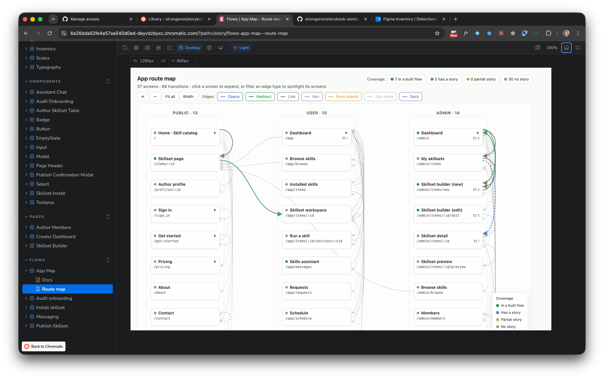

# storybook-workbench

**A Storybook toolkit for React + Vite apps — driven by your AI coding agent.**

Work *with* Storybook on a real codebase: audit what components are actually there (real vs. AI slop),
map the app's flows and user roles, write conformant CSF3 stories for only the states that matter, and
ship — across **Claude Code, Codex, and Cursor**. Everything lands under `.storybook/`, so `src/` stays
clean and the whole audit is one removable folder.

11 focused skills over a shared foundation, orchestrated by a hub — not one monolithic prompt.

---

## See it live

A Chromatic demo runs the full pipeline on a real, vibe-coded React + Vite app. The cover below is
its **actual output** — what these skills produce:

[](https://main--6a26dda52fe4a57aa540d0ed.chromatic.com)

**[▶ Open the live demo →](https://main--6a26dda52fe4a57aa540d0ed.chromatic.com)** — the published Storybook, redeployed from `main` on every merge, so the link never goes stale.

**What's inside:**
- **Component inventory** — real-vs-slop, detected from the app's actual imports.
- **App route map** — 37 screens across Public / User / Admin, scored by story coverage.
- **Design-system health** — colors, tokens, scales, and typography.
- **State coverage** — every state on one canvas, hover states, per-role views, A/B compares.
- **CSF3 stories** — only the materially-different states, no Cartesian blowup.

---

## Install

Works on any agent that supports the [Agent Skills](https://agentskills.io) standard.

**Any agent (skills.sh) — all 11 skills (the whole bundle):**
```bash
npx skills add strongeron/storybook-workbench          # installs ALL 11 skills
npx skills add strongeron/storybook-workbench --all    # same, fully non-interactive (all skills + all agents, -y) — for CI
```

**Just one skill** (each ships self-contained — its own scripts, references, wrappers, and the layout decorator):
```bash
npx skills add strongeron/storybook-workbench --list          # see the 11 skills
npx skills add strongeron/storybook-workbench -s sb-wrappers   # install only this one
npx skills use strongeron/storybook-workbench@sb-wrappers      # try it without installing
```
> Pipeline note: the *renderer* skills show data another skill produces — e.g. `sb-wrappers`'
> `ProjectInventory` reads `project-inventory.json` from `sb-inventory`, `DesignSystemHealth` reads
> `sb-health`'s output. Installed alone they work and render an **empty state** until that JSON exists;
> add the producer skill (or supply the JSON) for live data. The pure composition wrappers
> (`StateGrid`/`ABCanvas`/`StateMatrix`/`StorySet`) have no cross-skill dependency.

**Claude Code (plugin marketplace) — the whole bundle:**
```bash
claude plugin marketplace add strongeron/storybook-workbench
claude plugin install storybook-workbench@storybook-workbench
```

**Codex:** install **project-scoped** (drop `--global` — the skills CLI doesn't support global install for
Codex), run from your project root:
```bash
npx skills add strongeron/storybook-workbench --agent codex --yes
```

**Cursor:** skills are **project-scoped** (Cursor has no global skills dir) — run from your project root,
then reload the window:
```bash
npx skills add strongeron/storybook-workbench --agent cursor --yes
# then: Cmd/Ctrl+Shift+P → "Developer: Reload Window"
```
After reload the skills appear in Cursor's **`/` menu** under **Skills** — invoke one by name
(`/sb-hub`, `/sb-setup`, `/sb-inventory`, …), or just ask in plain language and the matching skill
triggers by description.

Then restart your agent session so it registers the skills.

### Updating

Skills install as a snapshot, so to pull the latest — new skills (like `sb-figma`), fixes, wrapper
updates — **re-run the add command**. It re-fetches and overwrites in place:

```bash
npx skills add strongeron/storybook-workbench --all          # update every installed skill to latest
npx skills add strongeron/storybook-workbench -s sb-figma    # update just one skill
```
Restart your agent session afterward so it re-registers the updated skills.

### Kick it off

| Agent | How it triggers | Start with |
|-------|-----------------|------------|
| **Claude Code** | by description, or by name | `/sb-hub`, or ask *"audit this React+Vite app and set up Storybook"* |
| **Cursor** | by name via `/`, or by description | reload the window, then `/sb-hub` (skills show under **Skills** in the `/` menu), or ask *"audit this React+Vite app and set up Storybook"* |
| **Codex** | by name | mention `$sb-hub`, or a specific `$sb-stories` / `$sb-audit` |

When unsure, start at **`sb-hub`** — it inspects the project and names the next step (or drives the whole flow).

---

## The skills

The core flow, in run order. Each writes to `.storybook/` and is invoked on its own — the hub routes you.

| # | Skill | Use it when you want to… | Writes |
|---|-------|---------------------------|--------|
| — | **sb-hub** | not sure what to run — *"what's next?"* Inspects state and routes (or drives the whole pipeline). | a report |
| 1 | **sb-setup** | install Storybook on an app that has none (defers to `npx storybook` native onboarding); asks where stories live. | `.storybook/` |
| 2 | **sb-inventory** | find **real vs. slop** — your components vs. vendored shadcn `ui/`, types/hooks, dead code — and the real prop-value usage at call sites. | `project-inventory.json` |
| 3 | **sb-flows** | map the whole app — routes, navigation **edges**, persistent nav chrome, and **user roles** (who reaches each screen). | `flows.json` |
| 4 | **sb-health** | design-system health — raw hex that should be tokens, undefined/orphan tokens, scale gaps, and `DESIGN.md` drift. | `design-system-health.json` |
| 5 | **sb-stories** | write a CSF3 story for **one** component covering only its materially-different states (no Cartesian blowup). | `stories/*.stories.tsx` † |
| 6 | **sb-wrappers** | scaffold Storybook-only views (StateGrid, ABCanvas, AppFlowGraph, ProjectInventory, DesignSystemHealth…). | `wrappers/*.tsx` |
| 7 | **sb-audit** | periodic catalog health — naming drift, archived/decision review, lifecycle tags, usage refresh. | `audit/*` |

**Event-triggered (outside the linear flow):**

| Skill | Use it when you want to… |
|-------|---------------------------|
| **sb-explore** | prototype a new/redesigned component in a sandbox **outside** `src/` (app code never depends on it). |
| **sb-ship** | graduate an Explore experiment to a production component (preserves history — `cp`, never `git mv`). |
| **sb-figma** | bridge Figma↔Storybook both ways via the native Figma MCP — map foundation tokens and deliver approved components (design→code), and build Code Connect mappings so Figma Dev Mode shows the real code (code→design). |

> Plus **sb-cross-agent-run** — a `bundle_only` orchestration skill that drives the whole pipeline cross-agent (Codex/Cursor build, Claude validates, one phase per turn). It ships with the bundle but isn't installed à la carte, so it's not in the 11 count above.

> † Stories go where `sb-setup` asked — default `.storybook/stories/`, or co-located `src/**/*.stories.tsx` if you own the repo long-term.

### Typical first run

```text
hub → setup (if needed) → inventory → flows → health → stories → wrappers / app-map → audit
```

In Claude Code that's just `/sb-hub` (it advances you through), or ask in plain language and the right skill triggers.

---

## Tested

This bundle ships a registry-readable eval surface at **`evals/evals.json`** — behavioral cases (skill-loaded
vs. baseline, with deterministic + LLM-judge assertions) covering the core claims of each skill: CSF3 import
conventions, real-vs-slop inventory, role-aware flow capture, adaptive route extraction, and
ship-preserve-experiment. It's the trust signal — the skills are tested, not just written.

---

## Found a bug? Strange behavior?

Let the skill draft a **sanitized** report — versions + `.storybook/*.json` shapes/counts only, never
your source, token values, or component names. From your project root:

```bash
~/.claude/skills/sb-hub/scripts/report-issue.sh --asked "…" --observed "…" --expected "…"
```

…or just tell **`sb-hub`** *"this is wrong / report a bug"* (Mode 3) and it runs the reporter for you. It
writes a local draft and prints a `gh issue create …` command + a blank-issue URL — **no network call;
you submit.** Or open an issue with the **Bug / strange behavior** template.

Every report compounds: report → reproduce → **eval case** → fix → field-learning. See
[`CONTRIBUTING.md`](./CONTRIBUTING.md). No skill rewrites itself at runtime — improvement is
human-reviewed and eval-gated.

---

## License

MIT. See [`LICENSE`](./LICENSE) and [`SECURITY.md`](./SECURITY.md). Changelog: [`CHANGELOG.md`](./CHANGELOG.md).
